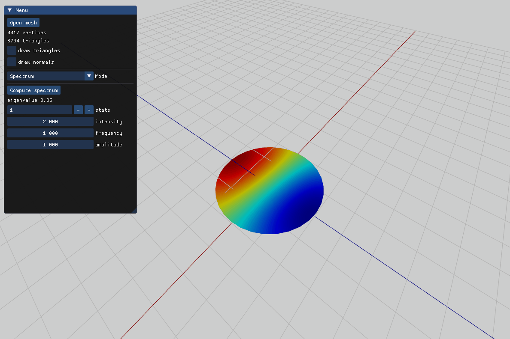
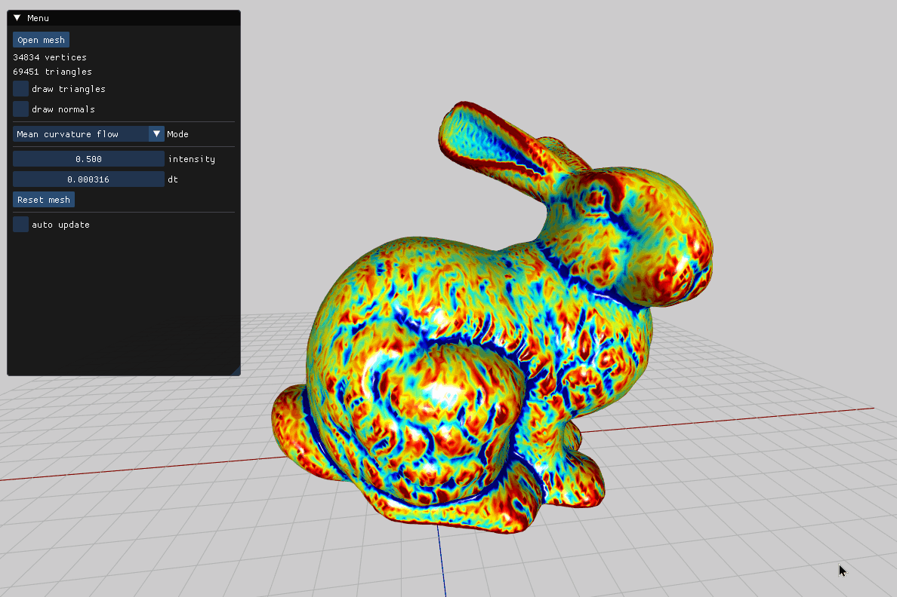
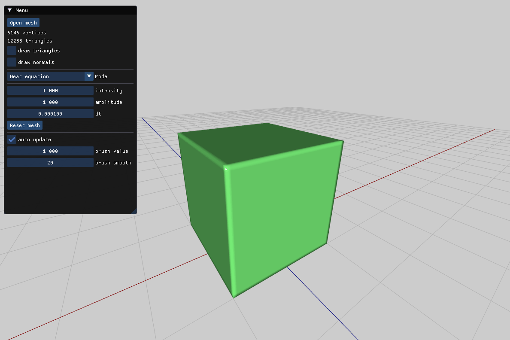
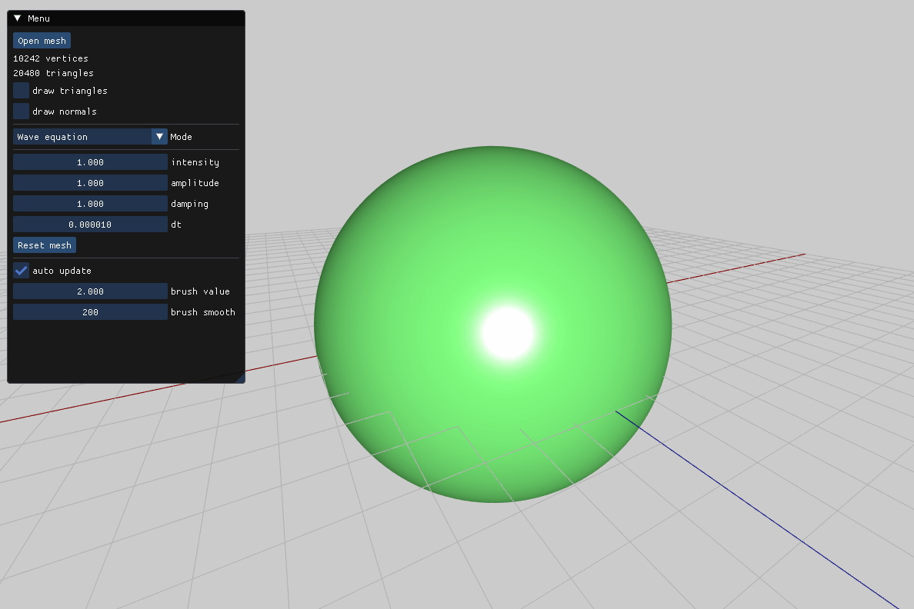

# Laplace

**Laplace** is a demo project for mesh Laplacian computation on 3D surfaces, featuring spectral decomposition, mean curvature flow, and heat and wave equation simulations. By loading `.obj` files, you can explore mathematical properties of meshes through these visual effects.

## Features

- **Laplacian Computation**: Computes the discrete Laplacian of a 3D mesh.
- **Spectral Decomposition**: Uses eigenvalues and eigenvectors to analyze surface properties.
- **Mean Curvature Flow**: Simulates surface smoothing based on mean curvature.
- **Heat and Wave Equations**: Simulates diffusion (heat) and oscillation (wave) on surfaces.

## Examples

### 1. Spectral Decomposition

### 2. Mean Curvature Flow

### 3. Heat Equation

### 4. Wave Equation

## Supported File Format

- **OBJ**: Import any `.obj` file for visualization. While the project supports most `.obj` files, certain complex or irregular meshes may lead to instability.

## Dependencies

This project relies on several open-source libraries:

- **[Eigen](https://eigen.tuxfamily.org/)** - Linear algebra library for matrix and vector operations.
- **[GLM](https://github.com/g-truc/glm)** - Geometry library for vector and matrix manipulation.
- **[SDL2](https://www.libsdl.org/)** - Handles window management and user input.
- **[OpenGL](https://www.opengl.org/)** - 3D rendering and visualization.
- **[Spectra](https://github.com/yixuan/spectra)** - Efficient eigenvalue computation library.
- **[ImGui](https://github.com/ocornut/imgui)** - GUI library for interactive elements in the application.
